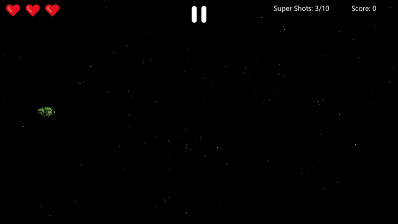

<h1>Space Impact</h1>

A simple 2D game based on the original

---

## Dependencies

* [Dart](https://dart.dev/)
* [Flutter](https://flutter.dev/)
* [Flame Engine](https://flame-engine.org/)

## Controls

<table>
<thead>
<tr><th>Keyboard shortcut</th><th>Description</th></tr>
</thead>
<tbody>
<tr><td><kbd>W</kbd> <kbd>A</kbd> <kbd>S</kbd> <kbd>D</kbd></td><td>Movement</td><tr>
<tr><td><kbd>Space</kbd></td><td>Shoot</td></tr>
<tr><td><kbd>Tab</kbd></td><td>SuperShoot</td></tr>
<tr><td><kbd>Escape</kbd></td><td>Pause</td></tr>
</tbody>
</table>